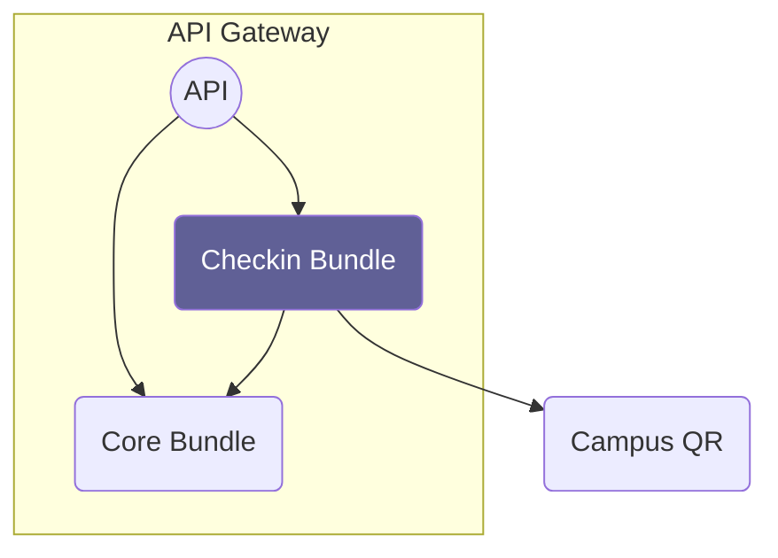

# Overview

Source: https://github.com/digital-blueprint/relay-checkin-bundle

This bundle handles check-ins to places and contact tracing for warning about COVID-19 cases.

You will need to install and set up the Digital Blueprint fork of [CampusQR](https://gitlab.tugraz.at/dbp/check-in/campus-qr),
the open source system for contact tracing at universities.

See [Check-in Website](https://handbook.digital-blueprint.org/blueprints/check-in) for more information.

There is a corresponding frontend application that uses this API at [Check-in Frontend Application](https://github.com/digital-blueprint/checkin-app).



## Bundle Configuration

Created via `./bin/console config:dump-reference DbpRelayCheckinBundle | sed '/^$/d'`

```yaml
# Default configuration for "DbpRelayCheckinBundle"
dbp_relay_checkin:
  campus_qr_url:        ~
  campus_qr_token:      ~
  authorization:
    policies:             []
    roles:
      # Returns true if the user is allowed to check in.
      ROLE_LOCATION_CHECK_IN: 'false'
      # Returns true if the user is allowed to check in guests.
      ROLE_LOCATION_CHECK_IN_GUEST: 'false'
    resource_permissions: []
    attributes:           []
```

The bundle has a `campus_qr_url` and a `campus_qr_token` configuration value that you can specify in your
app, either by hardcoding it, or by referencing an environment variable.

For this create `config/packages/dbp_relay_checkin.yaml` in the app with the following content:

```yaml
dbp_relay_checkin:
  campus_qr_url: 'https://campusqr.your.domain'
  campus_qr_token: 'secret token'
  authorization:
    roles:
      ROLE_LOCATION_CHECK_IN: 'user.isAuthenticated()'
      ROLE_LOCATION_CHECK_IN_GUEST: 'false'
```

Roles:

* `ROLE_LOCATION_CHECK_IN` - needs to evaluate to true for the user to be allowed to check in
* `ROLE_LOCATION_CHECK_IN_GUEST` - needs to evaluate to true for the user to be allowed to check in guests. Also requires `ROLE_LOCATION_CHECK_IN`.
